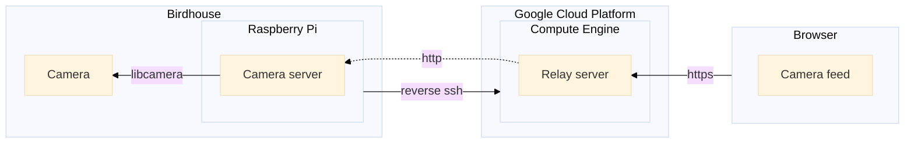

# birdhouse

```mermaid
---
config:
    theme: base
---
graph RL
    subgraph birdhouse[Birdhouse]
        subgraph pi[Raspberry Pi]
            pi-server[Camera server]
        end
        camera[Camera]
    end

    subgraph cloud[Google Cloud Platform]
        subgraph vm[Compute Engine]
            relay[Relay server]
        end
    end

    subgraph browser[Browser]
        stream[Camera feed]
    end

    pi-server -- libcamera --> camera
    pi -- reverse ssh --> vm

    relay -. http .-> pi-server
    
    browser -- https --> relay
```
